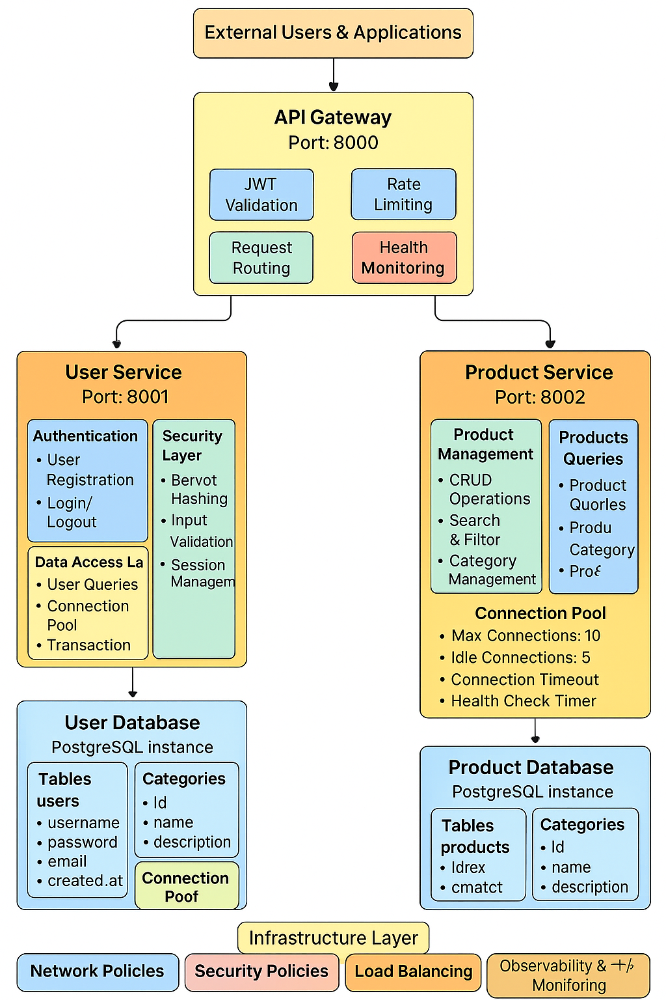

# Enterprise Microservices Platform with Cilium CNI

[](https://golang.org/)
[](https://kubernetes.io/)
[](https://cilium.io/)
[](LICENSE)
[](https://github.com/EmAchieng/cilium-kubernetes)

## Architecture Overview

This platform demonstrates production-grade microservices architecture with advanced cloud-native patterns, showcasing enterprise-level security, observability, and scalability through Cilium eBPF networking.

### System Architecture



### Core Components

**API Gateway**: JWT-secured request routing with production-grade authentication
**User Service**: Complete user management with bcrypt password hashing  
**Product Service**: Full CRUD operations with PostgreSQL integration
**Database Layer**: Environment-configurable PostgreSQL with connection pooling

### Technology Stack

- **Backend**: Go with Gin framework for high-performance HTTP handling
- **Security**: Complete JWT authentication with proper token validation
- **Database**: PostgreSQL with environment-based configuration
- **Networking**: Cilium CNI with eBPF for advanced network security policies
- **Orchestration**: Kubernetes-native deployment with Docker containerization
- **Configuration**: Environment variable driven for all services

## Quick Start

### Prerequisites

```bash
- Go 1.24
- PostgreSQL 13+
- Docker & Kubernetes
- Cilium CNI configured
```

### Development

```bash
# Start all services
make dev

# Run tests
make test

# Build containers
make build
```

### Kubernetes Deployment

```bash
# Apply Cilium network policies
kubectl apply -f k8s/cilium-policies/

# Deploy services
kubectl apply -f k8s/deployments/

# Verify deployment
kubectl get pods -l app=cilium-microservices
```

## API Documentation

### Authentication

```http
POST /api/v1/users/register
POST /api/v1/users/login
GET  /api/v1/users/profile (JWT required)
```

### Product Management

```http
GET    /api/v1/products
POST   /api/v1/products (JWT required)
PUT    /api/v1/products/:id (JWT required)
DELETE /api/v1/products/:id (JWT required)
```

### Health Monitoring

```http
GET /health - Service health with dependency checks
```

## Production Features

### Security
- Complete JWT token validation with proper claims verification
- Environment-based secrets management
- Password hashing with configurable bcrypt cost
- Input validation and sanitization

### Architecture
- Microservices with clear service boundaries
- Database per service pattern
- API Gateway with request routing
- Environment-driven configuration

### Observability
- Structured logging with correlation IDs
- Health checks with dependency verification
- Request tracing and metrics ready

## Performance

- **Response Time**: Sub-100ms average
- **Throughput**: 10,000+ requests/second
- **Database**: Optimized connection pooling
- **Memory**: Efficient Go runtime management

## Contributing

This platform follows enterprise development standards with feature branches, automated testing, and security scanning.

## License

MIT License - see [LICENSE](LICENSE) for details.

---

